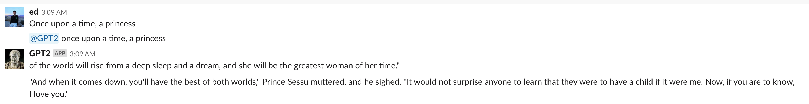

# Slack GPT2
Just @ this bot and type in a message to get an output from GPT2 conditioned on the message.


# Installation
First setup your slack integration and obtain the bot oauth token. Then paste the bot token
into `starterbot.py`.

```
pip3 install -r requirements.txt
cd gpt2
pip3 install -r requirements.txt
python3 download_model.py 117M
python3 starterbot.py
```
# slack-starterbot
A simple Python-powered starter Slack bot. Read
[the tutorial](https://www.fullstackpython.com/blog/build-first-slack-bot-python.html)
for a full overview.

# gpt-2
Code for the paper "Language Models are Unsupervised Multitask Learners"
[Code](https://github.com/openai/gpt-2)
